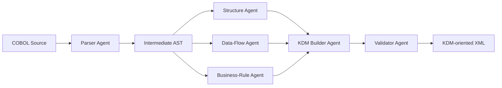

# Multi-Agent GenAI for COBOL-to-KDM Conversion

## Slide 1: Title

**Multi-Agent GenAI for COBOL-to-KDM Conversion**

**A prototype for recovering structure, data flow, and business rules from legacy COBOL**

- Project: Legacy COBOL Modernization
- Technology: ANTLR, Python, Pydantic, Gemini, XML
- Status: Research prototype

**Presenter note:** This project explores whether specialized agents can make COBOL understanding more structured and useful for software modernization.

---

## Slide 2: The Problem

- COBOL systems remain important in banking, insurance, government, and business operations.
- Much of the system knowledge is locked inside long, procedural source code.
- Manual program understanding is slow and depends on scarce legacy-system expertise.
- Modernization requires more than syntax parsing:
  - What are the program components?
  - Which data items are read or changed?
  - Which paragraphs call each other?
  - What business rules are implemented?

**Presenter note:** The challenge is knowledge recovery, not simply translating COBOL into another programming language.

---

## Slide 3: Project Objective

### Objective

Convert COBOL source code into a structured KDM-oriented representation using a multi-agent architecture.

### Target output

- Program and paragraph structure
- Data items and their types
- Calls between procedures
- Reads, writes, and computations
- Natural-language business-rule descriptions
- XML output that can support later modernization analysis

**Presenter note:** KDM is used as a target knowledge representation for understanding and analyzing existing software.

---

## Slide 4: Research Question

> Can a group of specialized analysis agents improve the quality and explainability of COBOL-to-KDM knowledge extraction compared with a single mapper or deterministic rules alone?

### Proposed comparison

1. Deterministic extraction only
2. One general-purpose GenAI mapper
3. Specialized multi-agent pipeline

### Measurements

- Entity extraction accuracy
- Call and data-flow accuracy
- Business-rule quality
- KDM validity rate
- Runtime and API cost
- Unsupported or hallucinated findings

**Presenter note:** The current implementation is the foundation for this experiment; the benchmark and measurements are the next research step.

---

## Slide 5: Overall Architecture



**Presenter note:** Parsing creates a shared intermediate representation. The analysis agents work independently on that representation, and the builder combines their findings.

---

## Slide 6: Agent Responsibilities

| Agent               | Responsibility                                 | Current approach            |
| ------------------- | ---------------------------------------------- | --------------------------- |
| Parser Agent        | Extract program, data, and procedure structure | ANTLR plus recovery logic   |
| Structure Agent     | Identify paragraphs and `PERFORM` calls        | Deterministic patterns      |
| Data-Flow Agent     | Identify reads, writes, and computations       | Deterministic patterns      |
| Business-Rule Agent | Describe conditions and rules                  | Gemini with local fallback  |
| KDM Builder Agent   | Combine findings into a model                  | Pydantic model construction |
| Validator Agent     | Detect duplicate and invalid elements          | Deterministic checks        |

**Presenter note:** Specialization makes each agent easier to inspect, test, and improve independently.

---

## Slide 7: Input Example

```cobol
       DATA DIVISION.
       WORKING-STORAGE SECTION.
       01  WS-COUNT PIC 9(3) VALUE 1.

       PROCEDURE DIVISION.
           IF WS-COUNT > 0
               DISPLAY 'COUNT IS POSITIVE'
           ELSE
               DISPLAY 'COUNT IS ZERO'
           END-IF.
           STOP RUN.
```

### Information to recover

- `WS-COUNT` is a storable data item.
- The main procedure contains a condition.
- The condition reads `WS-COUNT`.
- The procedure writes to display output.
- The condition expresses a possible business rule.

**Presenter note:** This small example makes the transformation visible to the audience before showing the larger architecture.

---

## Slide 8: Intermediate Findings

Example findings produced by the agents:

```text
Structure Agent
  MAIN-LINE -> CallableUnit

Data-Flow Agent
  MAIN-LINE reads WS-COUNT
  MAIN-LINE writes DISPLAY

Business-Rule Agent
  When WS-COUNT > 0, execute the conditional processing.

Builder Agent
  Combines these findings into one KDM model
```

### Why use an intermediate model?

- Agents share a stable contract.
- Findings retain agent identity and confidence.
- The builder is separated from extraction logic.
- Validation can happen before XML serialization.

---

## Slide 9: Generated KDM-Oriented Output

```xml
<model xmi:type="code:CodeModel" name="SAMPLE" language="COBOL">
  <codeElement xmi:type="code:StorableUnit" name="WS-COUNT"/>
  <codeElement xmi:type="code:CallableUnit" name="MAIN-LINE">
    <attribute tag="businessRule"
      value="When WS-COUNT &gt; 0, execute the conditional processing."/>
    <action kind="Reads" target="WS-COUNT"/>
    <action kind="Writes" target="DISPLAY"/>
  </codeElement>
</model>
```

### Result

The source is represented as structured program knowledge rather than only raw text.

**Presenter note:** Describe this as a simplified KDM-oriented XML representation. Do not claim full OMG KDM interchange compliance yet.

---

## Slide 10: Where GenAI Is Used

### Gemini-backed capability

- The Business-Rule Agent receives one COBOL paragraph at a time.
- It returns structured JSON using a defined response schema.
- The result is validated with Pydantic.
- Temperature is kept low for more consistent output.

### Reliability design

- If no API key is configured, local rules are used.
- If an LLM request fails, the agent falls back locally.
- Deterministic agents provide repeatable structural and data-flow extraction.

**Presenter note:** GenAI is used where semantic interpretation is useful, while deterministic analysis protects basic structural facts and reproducibility.

---

## Slide 11: Current Implementation Status

### Completed

- ANTLR COBOL parser integration
- Multi-agent package and orchestrator
- Structural, data-flow, and business-rule agents
- Pydantic intermediate and output models
- Gemini integration with fallback behavior
- XML serialization
- Basic validation
- Command-line execution
- Five local regression tests
- A two-case labeled pilot benchmark
- Reproducible JSON evaluation output

### Current maturity

**Working research prototype with initial measurable results**

Not yet a production converter or fully standards-validated KDM exporter.

---

## Slide 12: Preliminary Evaluation Results

### Pilot dataset

- 2 small COBOL programs
- Conditions, calculations, paragraph calls, displays, and data items
- Expected findings manually recorded in `evaluation/benchmark.json`

### Deterministic baseline: exact-set F1 by capability

| Capability          |  Pilot result |
| ------------------- | ------------: |
| Data items          |         1.000 |
| Paragraphs          |         1.000 |
| Procedure calls     |         1.000 |
| Writes              |         1.000 |
| Computes            |         1.000 |
| Reads               | 0.833 average |
| Business-rule count |     2/2 exact |

### Interpretation

- Results are encouraging for the supported patterns.
- The read score exposes an over-reporting problem in the second case.
- These baseline results are not Gemini results; the structural agents are deterministic.
- Two cases are a pilot, not evidence of general COBOL accuracy.

### Gemini-backed run

- API key was supplied and the evaluator requested Gemini.
- One paragraph encountered a temporary Gemini `503 UNAVAILABLE` response and used local fallback.
- One paragraph completed with Gemini and produced 5 rules where the benchmark expected 2.
- This is an early signal that semantic quality and rule granularity need evaluation, not proof that GenAI is better.

**Presenter note:** The deterministic report is `evaluation/results.json`; the Gemini-attempt report is `evaluation/results-gemini.json`. Expand the dataset and repeat the Gemini run before making broad claims.

---

## Slide 13: Limitations

- Current extraction uses regular expressions for several COBOL statements.
- Coverage is limited for advanced COBOL features such as copybooks, file I/O, `EVALUATE`, nested structures, and complex `PERFORM` forms.
- Business-rule descriptions may be too broad or incomplete.
- Agents currently produce findings independently and do not critique or reconcile one another.
- The XML is KDM-oriented but not yet validated against the complete OMG KDM metamodel.
- The current sample size is too small for general conclusions.

**Presenter note:** These limitations define the research opportunity rather than weakening the prototype. State them directly.

---

## Slide 14: Next Steps

### Immediate presentation milestone

- Verify the end-to-end demo.
- Add regression tests for the sample programs.
- Create a small labeled benchmark.
- Compare deterministic and multi-agent results.
- Record model, prompt, runtime, and cost information.
- Expand the pilot from 2 cases to at least 20 labeled cases.
- Add a single-agent GenAI baseline and ablation results.

### Research milestone

- Expand COBOL language coverage.
- Add source locations and provenance to findings.
- Add agent disagreement and review loops.
- Produce official KDM relationships and references.
- Validate output with a KDM-compatible tool.

---

## Slide 15: Conclusion

- The project demonstrates a practical architecture for COBOL knowledge recovery.
- Specialized agents separate syntax, structure, data flow, and semantic interpretation.
- Deterministic fallbacks improve reproducibility and demo reliability.
- The prototype establishes the foundation for a measurable research study.
- The next decisive step is evaluation against labeled COBOL examples and meaningful baselines.

### Final message

> Multi-agent GenAI can assist legacy-system understanding, but its value must be demonstrated through structured output, validation, and measurable comparison.

---

# Demonstration Script

## Before the presentation

1. Install dependencies from `requirements.txt`.
2. Run the pipeline without an API key first.
3. Keep the generated XML output available locally.
4. Optionally run a second version with Gemini enabled.
5. Record the demo so the presentation does not depend on network access.

## Live flow

1. Open `sample.cbl`.
2. Point out the data items, procedure statements, condition, and display.
3. Run:

```powershell
python -m multi_agent_kdm.run multi_agent_kdm/sample.cbl -o demo-output.kdm.xml
```

4. Show the generated XML.
5. Explain one finding from each analysis agent.
6. Compare local fallback output with Gemini output if available.
7. End by showing the limitations and evaluation plan.

## Questions to prepare for

### Is this full KDM?

Not yet. It is a simplified KDM-oriented representation and is a foundation for implementing complete OMG KDM relationships and schema validation.

### Why use multiple agents?

Different agents focus on different evidence types. This improves modularity, inspectability, and the ability to evaluate each capability separately.

### Why not use GenAI for everything?

Basic structure and data-flow facts benefit from deterministic extraction. GenAI is most useful for semantic interpretation, such as summarizing business rules.

### How do you measure success?

Use manually labeled COBOL examples and compare entity, call, data-flow, and business-rule extraction against the ground truth, along with validity, latency, and cost.

### What is the main contribution?

A modular, explainable prototype that combines parser-based extraction, specialized analysis agents, structured validation, and KDM-oriented serialization.
